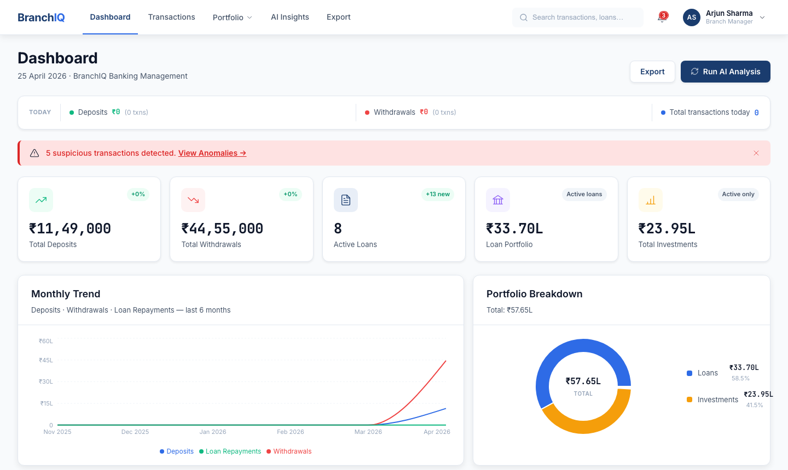
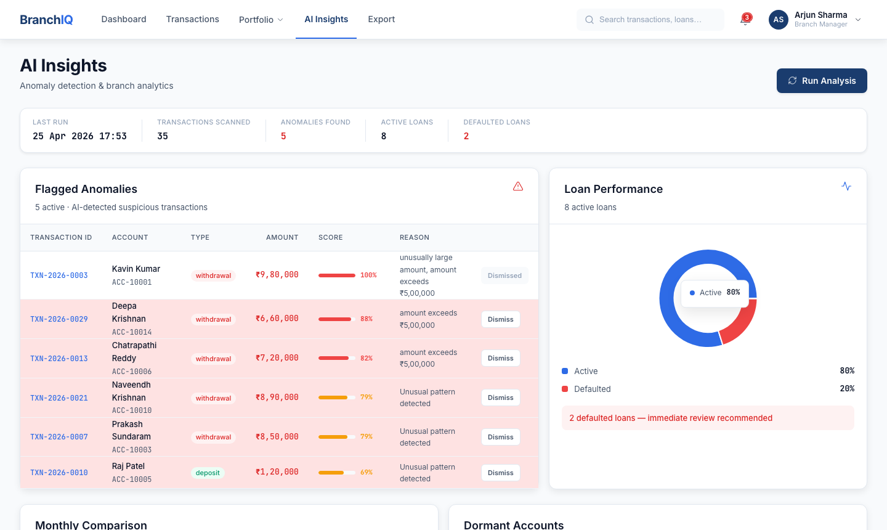
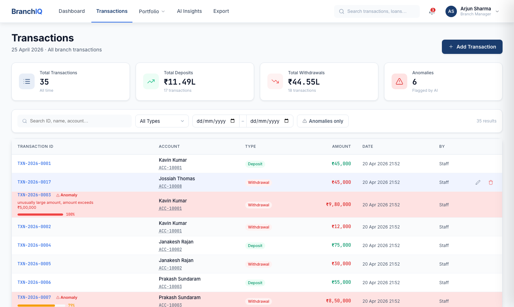
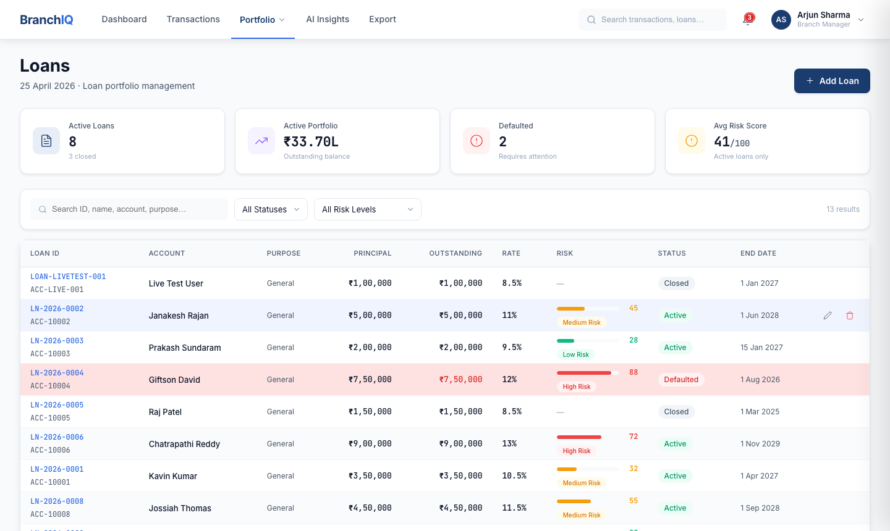
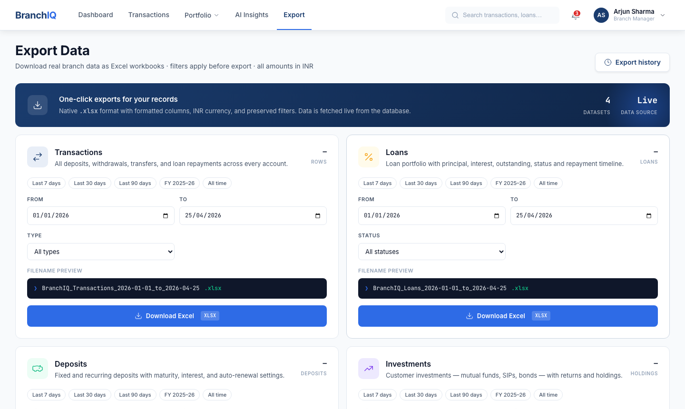
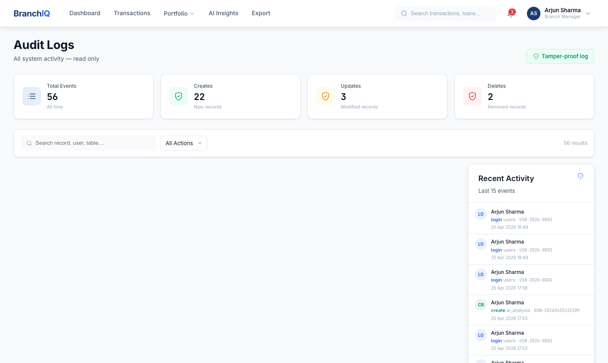

<div align="center">


# BranchIQ

**AI-Powered Banking Branch Management System**

[](https://github.com/kavincoder/branchiq/actions/workflows/ci.yml)
[](https://python.org)
[](https://fastapi.tiangolo.com)
[](https://react.dev)
[](https://postgresql.org)
[](LICENSE)

A full-stack internal banking tool for branch managers and staff — with real-time AI anomaly detection, complete audit trails, and one-click Excel exports.

[Features](#features) · [Tech Stack](#tech-stack) · [Quick Start](#quick-start) · [Architecture](#architecture) · [API](#api-reference) · [Contributing](#contributing)

</div>

---

## Screenshots

| Dashboard | AI Insights |
|-----------|-------------|
|  |  |

| Transactions | Loans |
|-------------|-------|
|  |  |

| Export | Audit Logs |
|--------|-----------|
|  |  |

---

## Overview

BranchIQ replaces fragmented spreadsheets and paper records with a unified management platform. Every transaction, loan, deposit, and investment is tracked in one place — with a machine learning model watching for suspicious activity in real time.

> Built as a portfolio project demonstrating production-grade patterns: ML integration, role-based auth, automated testing, soft deletes, audit logging, and Docker deployment.

---

## Features

### 💳 Transaction Management
- Full CRUD with search, filter by type, date range, and anomaly status
- **Account autocomplete** — type a name, account number fills automatically
- Duplicate detection within 24-hour windows
- Loan repayment linking — connect a transaction directly to an active loan

### 🤖 AI Anomaly Detection
- **IsolationForest** (scikit-learn) trained on your own transaction data
- Scores every transaction 0.0–1.0 — flags anything above 0.6
- Human-readable reasons: *"unusually large amount"*, *"transaction at unusual hour"*
- Dormant account detection (no activity in 30+ days)
- Model cached to disk, retrained only when new transactions are added

### 📊 Dashboard & Analytics
- Live KPIs: total deposits, withdrawals, % change vs. last month
- 6-month trend chart (deposits, withdrawals, loan repayments)
- Today's snapshot — real-time transaction counts and INR totals
- Top accounts leaderboard by transaction volume

### 🏦 Portfolio Management
- **Loans** — principal, interest rate, risk score, overdue detection
- **Deposits** — fixed & savings, maturity tracking
- **Investments** — mutual funds, govt bonds, fixed deposits

### 📁 Export
- One-click Excel download for all 4 datasets
- Styled `.xlsx` — navy header row, auto-width columns, frozen panes, alternating rows
- Date range + type filters applied before export

### 🔐 Security
- `bcrypt` password hashing (12 rounds, salted)
- JWT tokens stored in `httpOnly` cookies (XSS-proof)
- `SameSite=Lax` (CSRF protection)
- Role-based access: **Manager** vs **Staff**
- Rate limiting on auth endpoints (5 req/min per IP)
- Request body size cap (10 MB)

### 📋 Audit Trail
- Every create / update / delete / login is logged automatically
- Logs include: user, IP address, timestamp, affected record
- Soft deletes — records are hidden, never destroyed

---

## Tech Stack

| Layer | Technology | Purpose |
|-------|-----------|---------|
| **Backend** | FastAPI (Python 3.12) | REST API, dependency injection, async |
| **Database** | PostgreSQL 16 + SQLAlchemy 2 | Relational storage, ORM |
| **Validation** | Pydantic v2 | Request/response schema validation |
| **Auth** | bcrypt + PyJWT | Password hashing, stateless tokens |
| **ML** | scikit-learn IsolationForest | Unsupervised anomaly detection |
| **Frontend** | React 19 + Vite 8 | Component UI, fast HMR dev server |
| **Charts** | Recharts | Dashboard trend visualisations |
| **Export** | SheetJS (xlsx) | In-browser Excel generation |
| **Testing** | pytest + Vitest | 54 backend tests, frontend unit tests |
| **CI** | GitHub Actions | Auto-run tests on every push |
| **Deploy** | Docker + docker-compose | Dev and production configs |

---

## Quick Start

### Prerequisites
- Python 3.12+
- Node.js 20+
- PostgreSQL 16

### 1 — Clone
```bash
git clone https://github.com/kavincoder/branchiq.git
cd branchiq
```

### 2 — Backend
```bash
cd backend

# Create virtual environment
python3 -m venv venv
source venv/bin/activate  # Windows: venv\Scripts\activate

# Install dependencies
pip install -r requirements.txt

# Configure environment
cp .env.example .env
# Edit .env — set DATABASE_URL and generate a SECRET_KEY:
# openssl rand -hex 32

# Run database migrations
alembic upgrade head

# Seed demo data (optional)
python seed.py

# Start the server
uvicorn app.main:app --reload --port 8000
```

### 3 — Frontend
```bash
cd frontend
npm install
npm run dev
```

Open **http://localhost:5173**

### Demo Credentials
| Role | Username | Password |
|------|----------|----------|
| Manager | `arjun.manager` | `branchiq123` |
| Staff | `priya.staff` | `branchiq123` |

### Docker (one command)
```bash
# Development
docker-compose up --build

# Production
DB_PASSWORD=yourpassword SECRET_KEY=$(openssl rand -hex 32) \
  docker-compose -f docker-compose.prod.yml up --build
```

---

## Architecture

```
┌─────────────────────────────────────────────────────────┐
│                    Browser (React 19)                    │
│  Dashboard · Transactions · Loans · Deposits · AI · ...  │
└────────────────────────┬────────────────────────────────┘
                         │ HTTP + httpOnly cookie
                         ▼
┌─────────────────────────────────────────────────────────┐
│                  FastAPI Backend                         │
│                                                         │
│  /auth  /transactions  /loans  /deposits  /investments  │
│  /investments  /users  /ai  /audit-logs                 │
│                                                         │
│  ┌─────────────────┐   ┌──────────────────────────┐    │
│  │  Pydantic v2    │   │  IsolationForest (ML)     │    │
│  │  Validation     │   │  Anomaly detection        │    │
│  └─────────────────┘   └──────────────────────────┘    │
│                                                         │
│  ┌─────────────────┐   ┌──────────────────────────┐    │
│  │  bcrypt + JWT   │   │  Audit Logger             │    │
│  │  Auth           │   │  Every write logged       │    │
│  └─────────────────┘   └──────────────────────────┘    │
└────────────────────────┬────────────────────────────────┘
                         │ SQLAlchemy ORM
                         ▼
┌─────────────────────────────────────────────────────────┐
│                  PostgreSQL 16                           │
│  users · transactions · loans · deposits                │
│  investments · audit_logs                               │
└─────────────────────────────────────────────────────────┘
```

### Project Structure
```
branchiq/
├── backend/
│   ├── app/
│   │   ├── main.py              # App entry point, middleware
│   │   ├── config.py            # Settings from .env
│   │   ├── database.py          # Connection pool
│   │   ├── models/              # SQLAlchemy ORM models
│   │   ├── routers/             # API endpoints (one file per feature)
│   │   ├── schemas/             # Pydantic request/response models
│   │   ├── services/
│   │   │   ├── ai_engine.py     # IsolationForest ML pipeline
│   │   │   └── audit.py        # Audit log writer
│   │   └── utils/
│   │       ├── security.py      # bcrypt, JWT, auth dependencies
│   │       └── analytics.py    # Monthly sum helpers
│   ├── migrations/              # Alembic database migrations
│   ├── tests/                   # 54 pytest tests
│   └── seed.py                  # Demo data seeder
│
├── frontend/
│   └── src/
│       ├── api/client.js        # Centralised HTTP client
│       ├── context/             # Auth context (global user state)
│       ├── pages/               # One component per screen
│       └── components/          # Shared UI components
│
├── docker-compose.yml           # Development
├── docker-compose.prod.yml      # Production
└── .github/workflows/ci.yml     # GitHub Actions CI
```

---

## API Reference

All endpoints require authentication (cookie or `Authorization: Bearer <token>`).  
Interactive docs available at **http://localhost:8000/docs** when running locally.

| Method | Endpoint | Auth | Description |
|--------|----------|------|-------------|
| `POST` | `/auth/login` | Public | Login, sets httpOnly cookie |
| `POST` | `/auth/logout` | Any | Clears auth cookie |
| `GET` | `/transactions/` | Any | List with search + filters |
| `POST` | `/transactions/` | Any | Create transaction |
| `PUT` | `/transactions/{id}` | Any | Update transaction |
| `DELETE` | `/transactions/{id}` | Manager | Soft-delete |
| `GET` | `/loans/` | Any | List loans |
| `GET` | `/loans/overdue-count` | Any | Count past end_date |
| `GET` | `/deposits/` | Any | List deposits |
| `GET` | `/investments/` | Any | List investments |
| `GET` | `/users/` | Manager | List staff accounts |
| `POST` | `/users/` | Manager | Create staff account |
| `GET` | `/users/audit-logs` | Manager | Paginated audit trail |
| `GET` | `/ai/summary` | Any | Dashboard KPIs |
| `POST` | `/ai/run` | Any | Trigger ML analysis |
| `GET` | `/ai/anomalies` | Any | Flagged transactions |
| `GET` | `/ai/insights` | Any | Full AI panel data |
| `GET` | `/ai/daily-snapshot` | Any | Today's stats |
| `GET` | `/ai/monthly-trend` | Any | 6-month chart data |

---

## Testing

```bash
# Backend — 54 tests across 6 files
cd backend
pytest tests/ -v

# Frontend
cd frontend
npm test
```

### Test Coverage
| File | Tests | What's Covered |
|------|-------|---------------|
| `test_auth.py` | 8 | Login, logout, wrong password, inactive account, JWT |
| `test_transactions.py` | 9 | CRUD, validation, type checks, soft delete |
| `test_loans.py` | 9 | CRUD, status updates, role enforcement |
| `test_deposits.py` | 9 | CRUD, type filter, manager-only delete |
| `test_investments.py` | 9 | CRUD, status filter, soft delete |
| `test_ai.py` | 10 | Summary, snapshot, trend, anomalies, overdue count |

---

## Environment Variables

Copy `backend/.env.example` to `backend/.env` and fill in:

| Variable | Required | Description |
|----------|----------|-------------|
| `DATABASE_URL` | ✅ | PostgreSQL connection string |
| `SECRET_KEY` | ✅ | JWT signing key — min 32 chars (`openssl rand -hex 32`) |
| `ALGORITHM` | ✅ | JWT algorithm — use `HS256` |
| `ACCESS_TOKEN_EXPIRE_MINUTES` | ✅ | Token lifetime in minutes |
| `CORS_ORIGINS` | ✅ | Comma-separated allowed origins |
| `ENVIRONMENT` | ✅ | `development` or `production` |
| `DB_POOL_SIZE` | — | DB connection pool size (default: 10) |
| `DB_MAX_OVERFLOW` | — | Max overflow connections (default: 20) |

---

## Contributing

See [CONTRIBUTING.md](CONTRIBUTING.md) for guidelines.

1. Fork the repo
2. Create a branch: `git checkout -b feature/your-feature`
3. Make changes and add tests
4. Run the test suite: `pytest tests/ -v`
5. Open a pull request

---

## License

[MIT](LICENSE) — free to use, modify, and distribute.

---

<div align="center">
Built with FastAPI · React · PostgreSQL · scikit-learn
</div>
